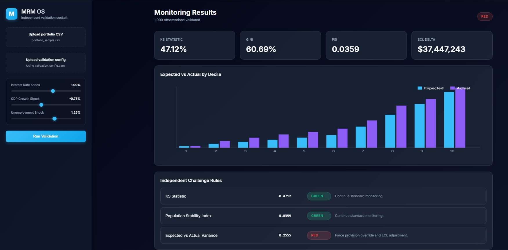
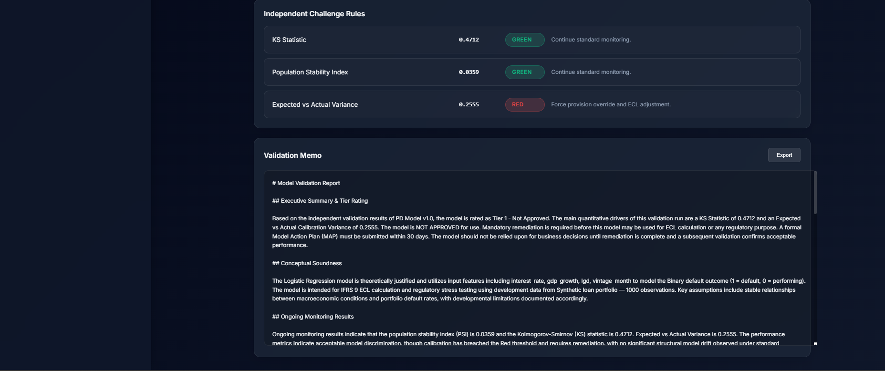

# MRM OS — Model Risk Management Operating System

> Automated SR 26-2 compliant model validation engine with 
> AI-interpreted reporting and interactive stress testing cockpit.

---

## What It Does

MRM OS is an end-to-end model validation engine built to the standards 
of SR 26-2 (April 2026, superseding SR 11-7). It accepts a loan 
portfolio CSV and a validation config file, runs a full suite of 
quantitative validation tests, applies multi-factor macro stress 
scenarios, and generates a structured AI-interpreted validation memo — 
automatically.

No manual report writing. No spreadsheet-based backtesting. 
One config file, one CSV, one click.

---

## Key Features

- **SR 26-2 Compliant Validation** — KS Statistic, Population 
  Stability Index, AUC/Gini, Hosmer-Lemeshow χ²(df) with p-value, 
  and Calibration Variance computed against predefined RAG thresholds

- **AI-Interpreted Reporting** — Each report section (Conceptual 
  Soundness, Ongoing Monitoring, Breach Narrative, Stress Narrative, 
  Overrides & Limitations) is generated by an LLM using structured 
  validation context — not templates, not hardcoded text

- **Multi-Factor Stress Testing** — Simultaneous shocks to interest 
  rate, GDP growth, and unemployment. Stressed ECL computed and 
  compared against base. Stressed calibration metrics recomputed 
  under shocked PDs

- **Interactive Validation Cockpit** — Web-based dashboard with 
  real-time shock sliders, Expected vs Actual by Decile chart, 
  RAG-coded Independent Challenge Rules table, and one-click 
  Validation Memo export

- **Quality-Gated Report Generation** — Pre-flight checks block 
  any report containing placeholder text, blank sections, or 
  sub-threshold narrative length before rendering

- **Model Action Plan Triggers** — Tier rating logic automatically 
  escalates to Not Approved with MAP requirement when any metric 
  breaches Red threshold

---

## Sample Output

**Dashboard**

**Validation Memo (sample)**

→ [View Sample Report](docs/sample_report.md)

---

## Tech Stack

| Layer | Technology |
|---|---|
| Backend | Python, FastAPI |
| Validation Engine | NumPy, Pandas, Scikit-learn, SciPy |
| AI Reporting | Grok API (x.ai) |
| Frontend Cockpit | HTML / JS / Uvicorn |
| Config Management | YAML |

---

## How It Works

Analyst fills validation_config.yaml with model metadata
Upload portfolio CSV via the cockpit UI
Set macro shock parameters using the sliders
Click Run Validation
Engine computes all metrics, applies stress, generates ECL impact
AI produces section-by-section narrative using validation context
Quality gate checks all sections before report renders
Export Validation Memo as markdown

---

## Validation Metrics Computed

| Metric | Threshold: Green | Threshold: Red |
|---|---|---|
| KS Statistic | > 0.30 | < 0.20 |
| Population Stability Index | < 0.10 | > 0.25 |
| Expected vs Actual Variance | < 0.05 | > 0.10 |
| AUC | > 0.75 | < 0.60 |
| Hosmer-Lemeshow | p > 0.05 | p < 0.01 |

---

## Regulatory Alignment

This engine is built to the principles outlined in:

- **SR 26-2** — Supervisory Guidance on Model Risk Management 
  (Federal Reserve / OCC / FDIC, April 2026)
- **IFRS 9** — Expected Credit Loss calculation and stress testing
- **Basel III/IV** — PD/LGD/EAD framework alignment

Validation components map directly to SR 26-2 Section V:
Conceptual Soundness, Outcomes Analysis, and Ongoing Model Monitoring.

---

## Project Context

This engine was built as an independent portfolio project alongside 
a Basel-aligned PD/LGD/EAD credit risk model on the full 2007–2018 
LendingClub dataset.

→ [LendingClub Credit Risk Model](https://github.com/suyashqf/credit-risk-model-lending-club)

Both projects are intended to demonstrate end-to-end credit risk 
and model risk management capability — from model development 
through independent validation.

---

## Limitations

- Stress testing uses a logit shift approximation. Rank-order 
  discrimination metrics (KS, AUC) are invariant to this methodology 
  as PDs scale proportionally. Calibration Variance reflects true 
  stressed impact.
- Validated on synthetic portfolio data (1,000 observations). 
  Tail-risk events may be underrepresented.
- LGD assumed constant under stress. Dynamic LGD stress is 
  out of scope for current version.

---

## Author

**Suyash**  
MBA (Finance) — IFMR GSB, Krea University  
[LinkedIn](www.linkedin.com/in/suyashbajpayee) | 
[LendingClub Model](https://github.com/suyashqf/credit-risk-model-lending-club)

---

*Built independently. Not affiliated with any banking organization 
or regulator.*
